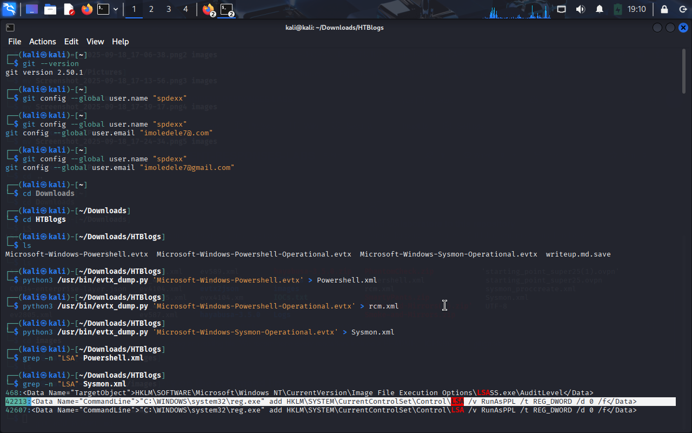
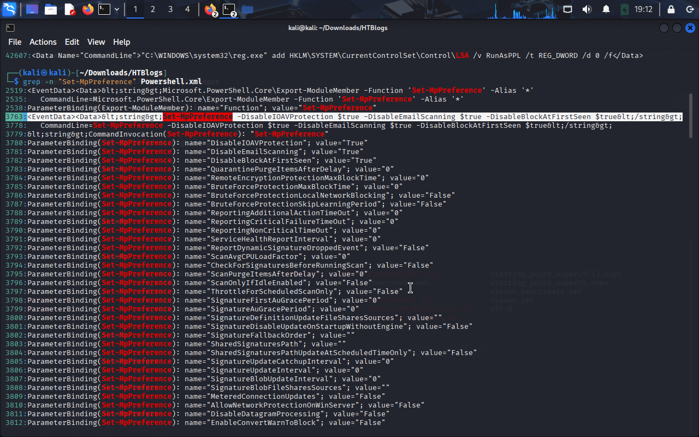
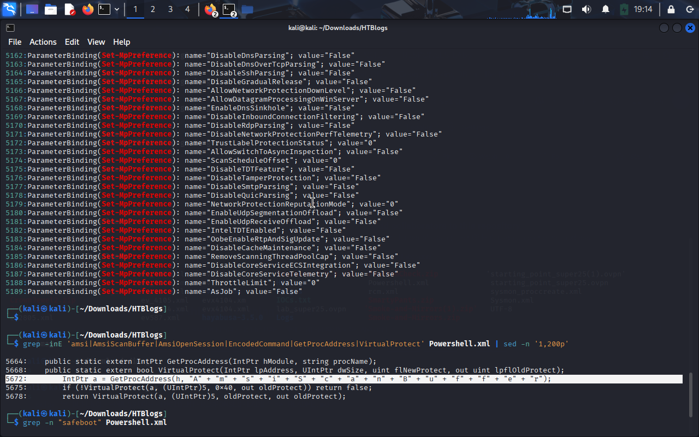
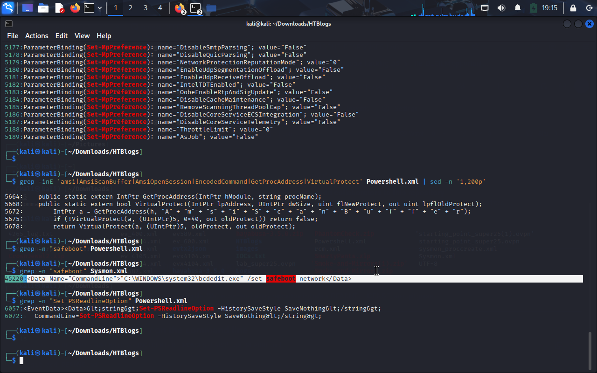
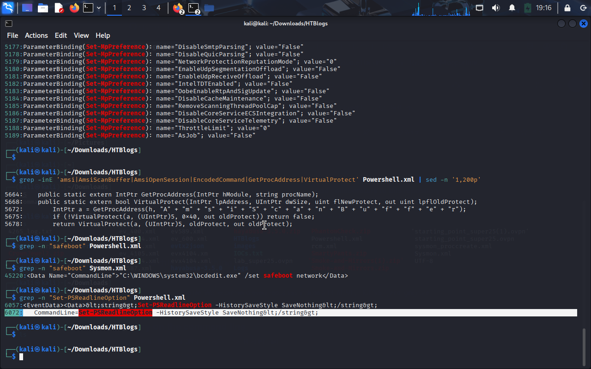

# DFIR Case Study — Byte Doctor Reyes / Defense Evasion

*Date:* 2025-19-09 
*Role:* Incident Responder  
*Artifacts used:* Microsoft-Windows-Powershell-Operational.evtx, Microsoft-Windows-Sysmon-Operational.evtx, Microsoft-Windows-Powershell.evtx

---

## Summary
Byte Doctor Reyes suspected an attacker disabled local protections to avoid detection. We investigated PowerShell and Sysmon logs to find registry changes, Defender-disable commands, AMSI tampering, safe-mode reboot, and command-history disabling.

---

## Q1 — LSA protection registry key
*Question:* 
The attacker disabled LSA protection by modifying a registry key. What is the full path?  
*Answer:* 
HKLM\SYSTEM\CurrentControlSet\Control\LSA  

*Command run:*
```bash
grep -n "LSA" Sysmon.xml

```



 ## Q2 — First command to disable Windows Defender

*Question*
 Which PowerShell command did the attacker first execute to disable Defender?
*Answer*
Set-MpPreference -DisableIOAVProtection $true -DisableEmailScanning $true -DisableBlockAtFirstSeen

*Command run:*
```bash
grep -n "Set-MpPreference" Powershell.xml

```




## Q3 — AMSI patching

*Question*
 Which function in the DLL is being patched to disable AMSI?
*Answer*
 AmsiScanBuffer

*Command run:*
```bash
grep -inE 'amsi|AmsiScanBuffer|AmsiOpenSession|EncodedCommand|GetProcAddress|VirtualProtect' Powershell.xml | sed -n '1,200p'

```



## Q4 — Safe Mode reboot

*Question*
 Which command did the attacker use to restart the machine in Safe Mode?
*Answer*
"C:\WINDOWS\system32\bcdedit.exe" /set safeboot network

*Command run:*
```bash
grep -n "safeboot" Sysmon.xml

```




## Q5 — Disable PowerShell history

*Question*
Which PowerShell command disabled command history logging?
*Answer*
Set-PSReadlineOption -HistorySaveStyle SaveNothing

*Command run:*
```bash
grep -n "Set-PSReadlineOption" Powershell.xml

```


